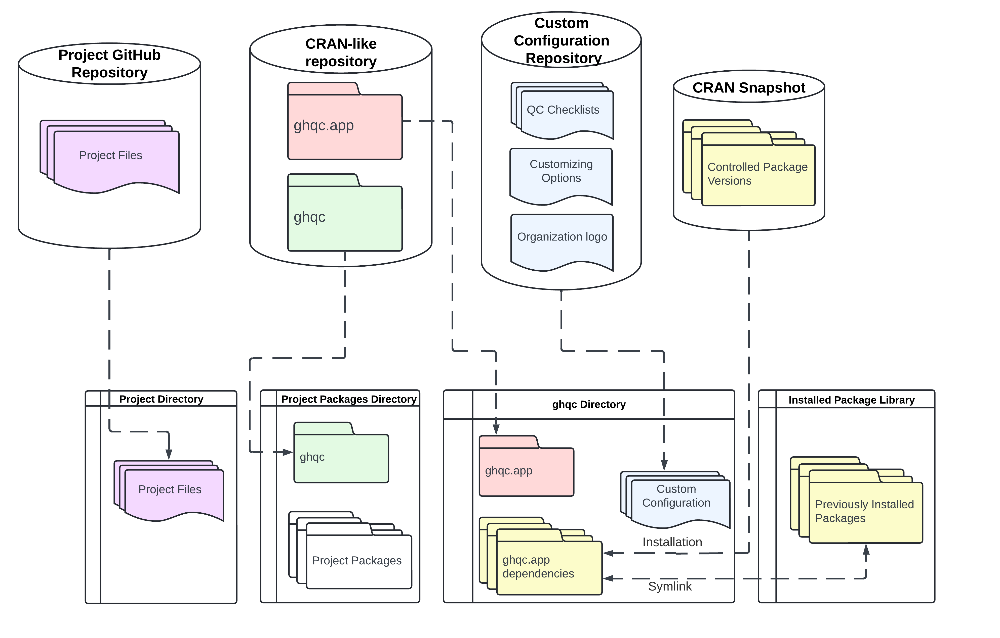
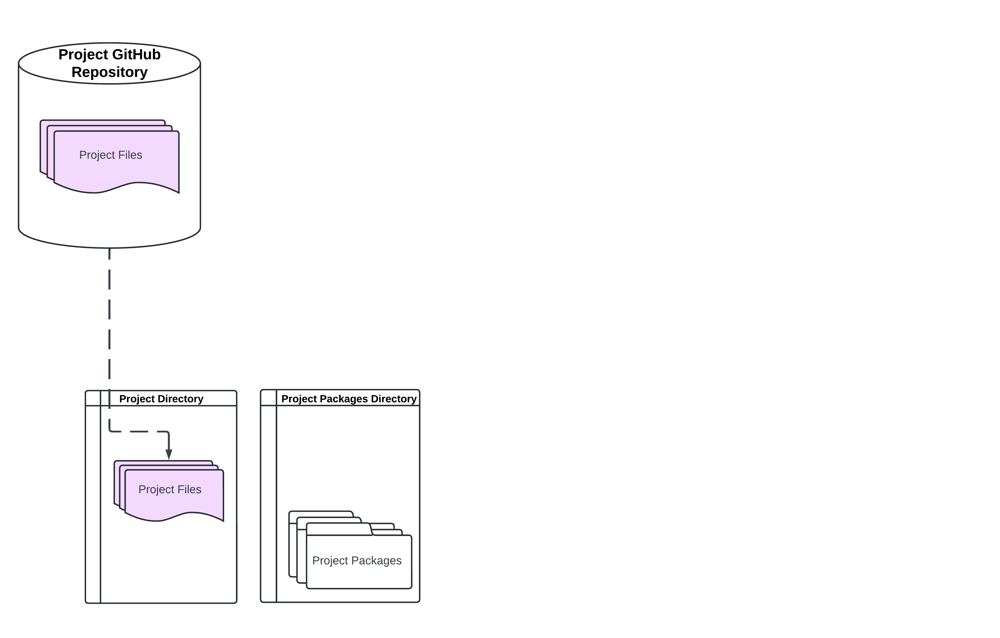
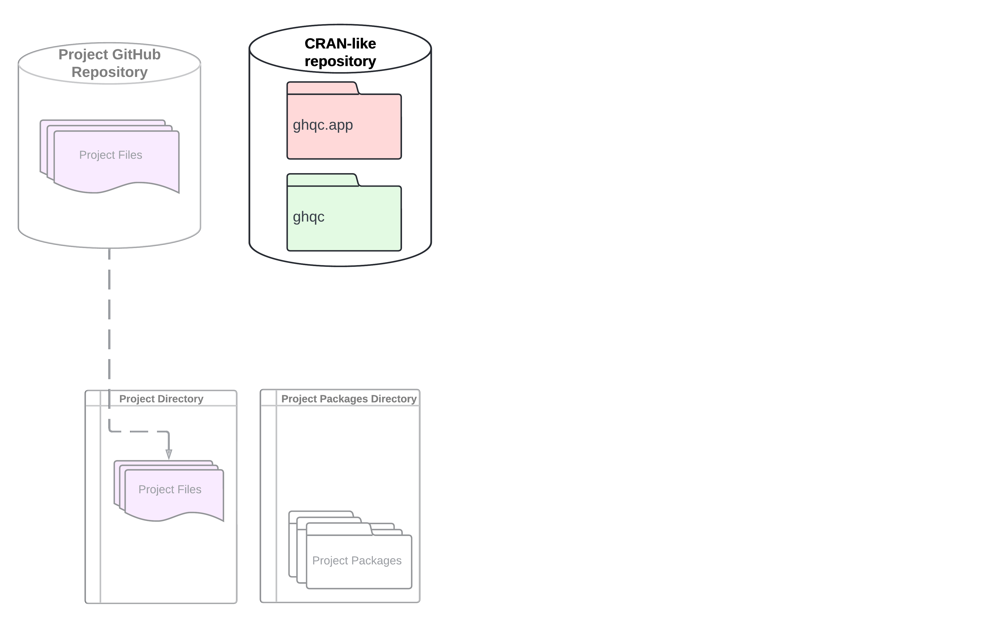
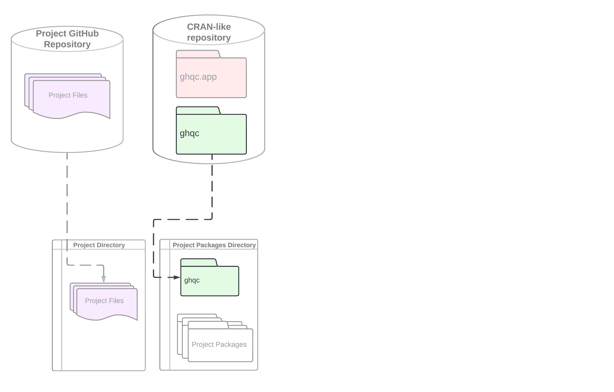
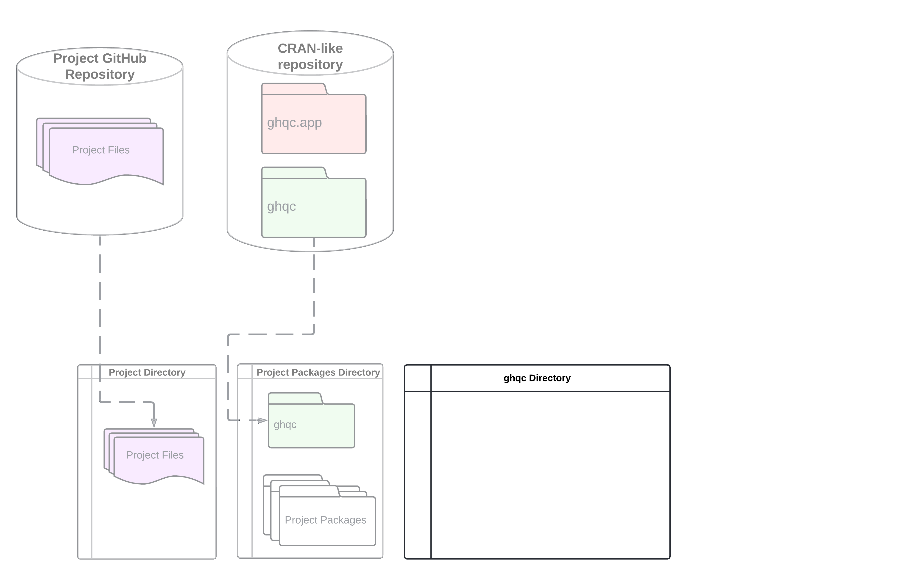
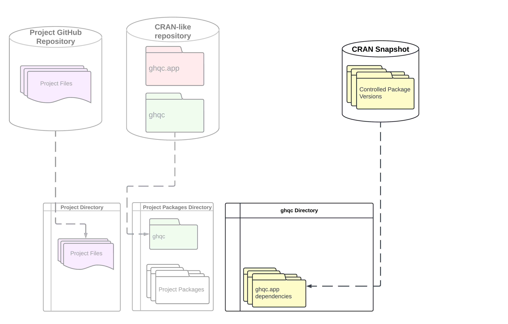
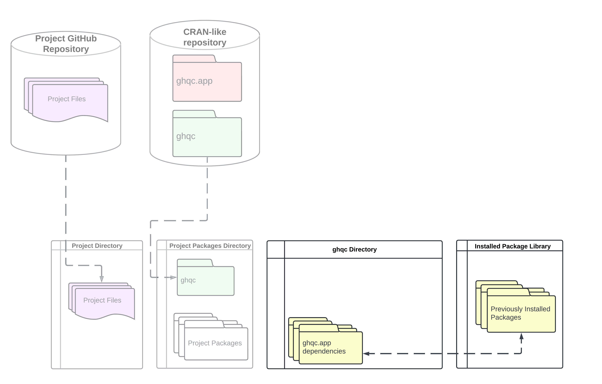
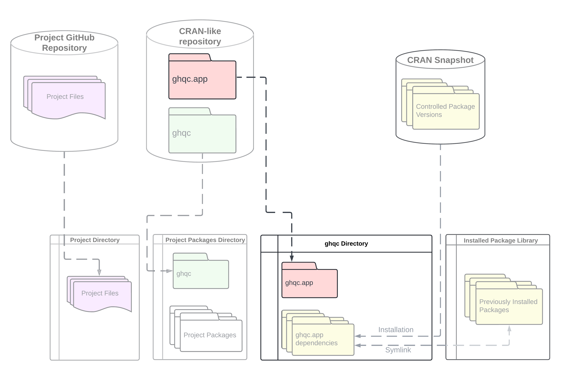
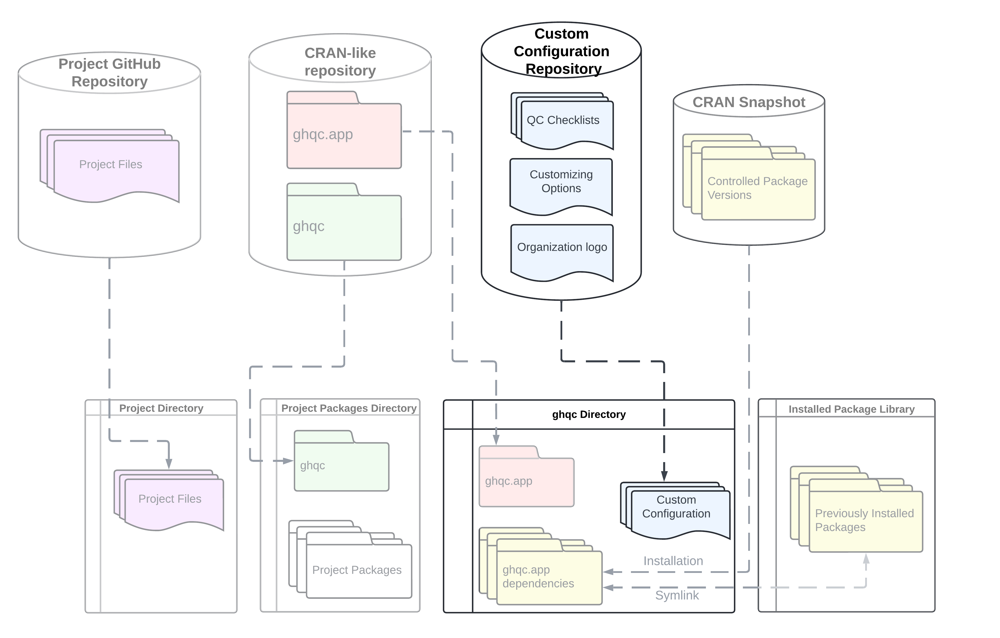

import { Tabs, TabItem, Card, Aside, FileTree, Badge } from '@astrojs/starlight/components';
import TwoColumnGrid from '/src/components/TwoColumnGrid.astro';

The [Installation Guide](../guides/1_install) begins with: 

> *"The ghqc ecosystem has 4 main components, each uniquely setup to give you, the user, as much control over the process, 
> while ensuring project work is not influenced."*

You may be wondering, how do we make such assurances? We'll begin with the full diagram below, which shows how each component is loaded to controlled locations on the system.

Then we'll build the diagram piece by piece, explaining how each component interacts with the others.

<Aside type="note">
Partnered with each diagram below is an example file structure of what the diagram represents.
</Aside>

<Tabs syncKey="diagramFile">
    <TabItem label="Diagram">
        
    </TabItem>
    <TabItem label="File Structure">
        <FileTree>
        - ~/
            - projects/
                - project_1/ **Project Directory**
                    - .git/
                    - scripts/
                    - project_1.Rproj
            - R
                - x86_64-pc-linux-gnu-library/ **Project Packages Directory**
                    - dplyr/
                    - withr/
                    - cli/
                    - glue/
                    - fs/
                    - **ghqc/**
                    - .../
            - .local/share/ghqc/ **ghqc Directory**
                - rpkgs/ **ghqc.app dependencies**
                    - dplyr/
                    - gert/
                    - shiny/
                    - digest/
                    - gitcreds/
                    - **ghqc.app/**
                    - .../ Plus 144 more packages
                - ghqc.custom_config **Custom Configuration**
                    - logo.png
                    - options.yaml
                    - checklists
                        - report.yaml
                        - data_assembly.yaml
        - /opt/rpkgs/ **Installed Package Library**
            - dplyr/
            - gert/
            - shiny/
            - digest/
            - gitcreds/
            - .../
        </FileTree>
    </TabItem>
</Tabs>

## Before ghqc

Before you start the QC, the diagram below likely represents the structure of your project. There may be slight nuances based on your system, but this generalization will work for most.

<Tabs syncKey="diagramFile">
    <TabItem label="Diagram">
        
    </TabItem>
    <TabItem label="File Structure">
        <FileTree>
            - projects/
                - **project_1/** your **Project Files**
                    - .git/
                    - scripts/
                    - project_1.Rproj
            - R/
                - **x86_64-pc-linux-pc-linux-gnu-library/** your **Project Packages**
                    - dplyr/
                    - withr/
                    - cli/
                    - glue/
                    - fs/
                    - .../
        </FileTree>
    </TabItem>
</Tabs>

You will have your project files, which are connected to a GitHub Repository, and your project packages. 
During project work, your project files are interacting with a specific set of package versions. 
Changes to these packages can lead to unexpected changes to the outcome of a project and should be kept to a minimum.

## The CRAN-like repository

As mentioned in the [Installation Guide](../guides/1_install), the ghqc ecosystem utilizes 2 R packages. 

<Card title = "ghqc vs ghqc.app">
<Tabs>
    <TabItem label = "ghqc"> 
        <TwoColumnGrid>
            The `ghqc` package is a lightweight package designed to be installed alongside project packages.
            With minimal dependencies and no version limits, this package will not impact packages that the project depends on, thus not causing unexpected outcome changes.

            
        </TwoColumnGrid>
    </TabItem>
    <TabItem label = "ghqc.app">
        <TwoColumnGrid>
            The `ghqc.app` package is a dependency heavy and restrictive package. 
            Installation alongside the project packages may lead impact packages that the project depends on, causing unknown behavior which may lead to unexpected errors or outcomes. 

            
        </TwoColumnGrid>
    </TabItem>
</Tabs>
</Card>

These packages are distributed on a CRAN-like repository. The most recent version is hosted on [the A2-Ai R-universe](https://a2-ai.r-universe.dev). 

<Tabs syncKey="diagramFile">
    <TabItem label="Diagram">
        
    </TabItem>
    <TabItem label="File Structure">
        <FileTree>
            - projects/
                - project_1/
                    - .git/
                    - scripts/
                    - project_1.Rproj
            - R/
                - x86_64-pc-linux-pc-linux-gnu-library/
                    - dplyr/
                    - withr/
                    - cli/
                    - glue/
                    - fs/
                    - .../
        </FileTree>
    </TabItem>
</Tabs>

<Aside type = "note"> 
    For some organizations, approved package versions may be required and are hosted/distributed differently. The core principals detailed here still apply.
    
    *Contact your system administrator with questions if this may apply to you.* 
</Aside>

## Installing `ghqc`

The dependency light `ghqc` is installed alongside your project packages. 
By installing this package alongside your project packages, you're able to easily access the setup helper functions and launch the ghqc Shiny apps from the package.

<Tabs syncKey="diagramFile">
    <TabItem label="Diagram">
        
    </TabItem>
    <TabItem label="File Structure">
        <FileTree>
            - projects/
                - project_1/
            - R/
                - x86_64-pc-linux-pc-linux-gnu-library/
                    - dplyr/
                    - withr/
                    - cli/
                    - glue/
                    - fs/
                    - **ghqc/**
                    - .../
        </FileTree>
    </TabItem>
</Tabs>

## The ghqc Directory

The key to the setup is the **ghqc Directory**. This is where we install `ghqc.app`, isolate its dependency packages, and download the custom configuration repository. 
Your project files and packages do not "know" about this directory, thus will not be impacted by any of its content.

We will continue on describing how each component gets into this directory, but wanted to pause to introduce the concept first.

<Tabs syncKey = "diagramFile">
    <TabItem label = "Diagram">
        
    </TabItem>
    <TabItem label = "File Structure">
        <FileTree>
            - projects/
                - project_1/
            - R
                - x86_64-pc-linux-gnu-library/
            - **.local/share/ghqc/** The **ghqc directory**
        </FileTree>
    </TabItem>
</Tabs>

## Isolating the `ghqc.app` dependencies

`ghqc.app` depends on [149 packages](reference/ghqcapp-dependencies), with fairly restrictive dependency limits.
<Aside type = "tip">
We recommend a package snapshot of 2024-03-01 or later for best results. The methods within `ghqc` described below will only isolate package versions as of 2024-03-01 or later..
</Aside>

###### Within `ghqc`, you are provided with two methods to isolate all of these packages:

<Tabs syncKey="isoMethod">
    <TabItem label = "Install">
        <Card title = "Installing the ghqc.app dependencies">
            The simplest option
            
            `install_ghqcapp_dependencies` ([or option 1 in `setup_ghqc()`](../guides/1_install#installing-the-ghqc-shiny-app-dependencies)) 
            will install the dependencies from [Posit Package Manager at 2024-03-01](https://packagemanager.posit.co/client/#/repos/cran/setup?snapshot=2024-03-01). 

            <Tabs syncKey = "diagramFile">
                <TabItem label = "Diagram">
                    
                </TabItem>
                <TabItem label = "File Structure">
                    <FileTree>
                        - projects/
                            - project_1/
                        - R
                            - x86_64-pc-linux-gnu-library/
                                - dplyr/ <Badge text="NOTE" variant="note"/>
                                - withr/
                                - cli/
                                - glue/
                                - fs/
                                - ghqc/
                                - .../
                        - .local/share/ghqc/
                            - **rpkgs/**
                                - dplyr/ <Badge text="NOTE" variant="note"/>
                                - gert/
                                - shiny/
                                - digest/
                                - gitcreds/
                                - .../ Plus 144 more packages
                    </FileTree>
                    <Aside type="note" title = "NOTE">
                        `dplyr` is in both the project packages and a dependency of `ghqc.app`. This may have lead to a version conflict if installed directly alongside the project packages.
                    </Aside>
                </TabItem>
            </Tabs>

        </Card>
    </TabItem>
    <TabItem label = "Link">
        <Card title = "Symlinking to a preinstalled library">
            If you have all of the packages, with versions greater than equal to that on 2024-03-01, previously installed in a different location, you are able to symlink to them. 
            
            We found during development, some organizations have a package snapshot previously installed on their system, so for speed and compliance, `ghqc` will symlink to the packages. 
            
            The dependency package isolation is still needed to ensure any projects that use a different package set are not effected.

            <Tabs syncKey = "diagramFile">
                <TabItem label = "Diagram">
                    
                </TabItem>
                <TabItem label = "File Structure">
                    <FileTree>
                    - ~/
                        - projects/
                            - project_1/
                        - R
                            - x86_64-pc-linux-gnu-library/
                        - .local/share/ghqc/
                            - **rpkgs/**
                                - *dplyr/*
                                - *gert/*
                                - *shiny/*
                                - *digest/*
                                - *gitcreds/*
                                - *.../* Plus 144 more packages
                    - /opt/rpkgs/
                        - dplyr/
                        - gert/
                        - shiny/
                        - digest/
                        - gitcreds/
                        - .../
                    </FileTree>
                </TabItem>   
            </Tabs>
        </Card>
    </TabItem>
</Tabs>

## Installing `ghqc.app`

Once the dependencies are isolated to the ghqc directory, you can install `ghqc.app`. 
This package is the "back-end" to the Shiny applications and does the heavy lifting for the ghqc ecosystem.

<Tabs syncKey = "diagramFile">
    <TabItem label = "Diagram">
        
    </TabItem>
    <TabItem label = "File Structure">
        <FileTree>
            - projects/
                - project_1/
            - R
                - x86_64-pc-linux-gnu-library/
            - .local/share/ghqc/
                - rpkgs/
                    - dplyr/
                    - gert/
                    - shiny/
                    - digest/
                    - gitcreds/
                    - **ghqc.app/**
                    - .../ Plus 144 more packages
        </FileTree>
    </TabItem>
</Tabs>

## Downloading the Custom Configuration Repository

The [custom configuration repository](../reference/custom_config) is the last piece of the ghqc infrastructure setup, 
which is also downloaded to the ghqc Directory.

<Tabs syncKey = "diagramFile">
    <TabItem label = "Diagram">
        
    </TabItem>
    <TabItem label = "File Structure">
        <FileTree>
            - projects/
                - project_1/
            - R
                - x86_64-pc-linux-gnu-library/
            - .local/share/ghqc/
                - rpkgs/
                - **ghqc.custom_config**
                    - logo.png
                    - options.yaml
                    - checklists
                        - report.yaml
                        - data_assembly.yaml
        </FileTree>
    </TabItem>
</Tabs>

